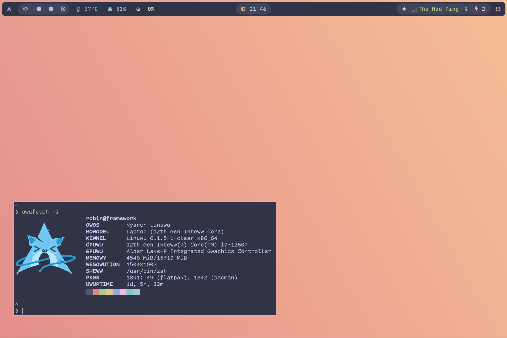
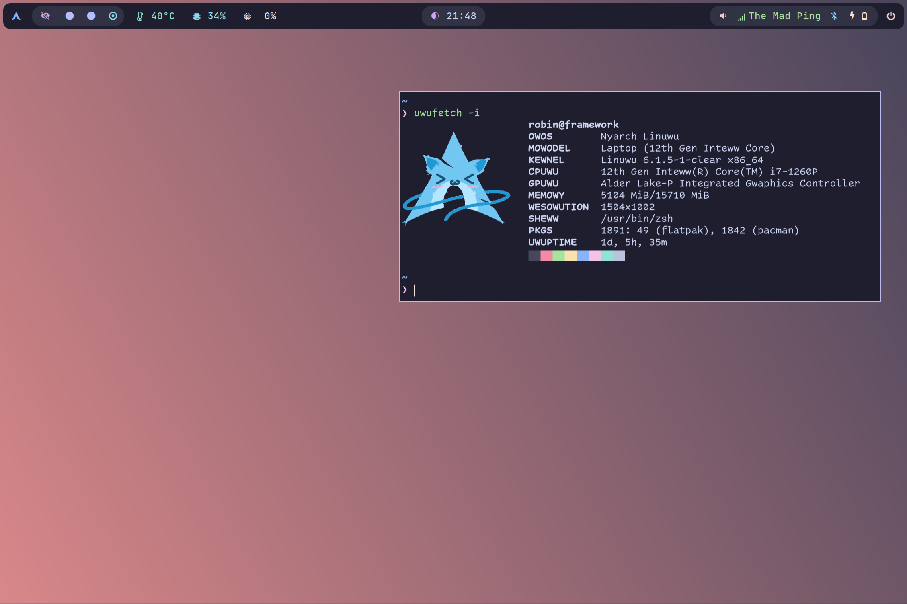
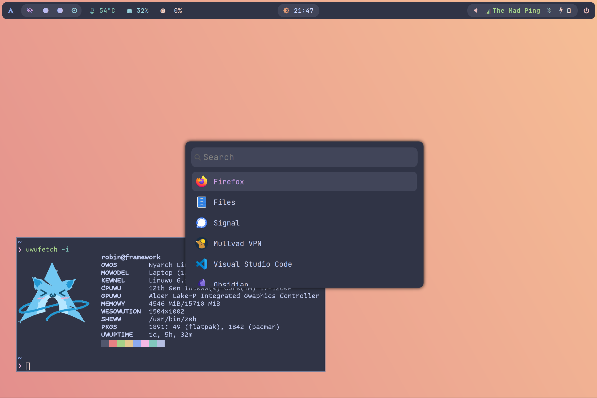

# Framework Arch Dots [WIP]

My [Catppuccin](https://github.com/catppuccin/catppuccin) focused Sway setup I'm running on the [Framework](https://frame.work) laptop.

Dotfiles are managed by [chezmoi](https://www.chezmoi.io). This is still WIP, more to come.

## Screenshots

| Frappe (light mode) | Mocha (dark mode) | Wofi |
| --- | --- | --- |
|  |  |  |

## Packages

| What | Package | Notes |
| --- | --- | --- |
| WM | Sway | [config](https://github.com/r2binx/framework-dots/tree/main/private_dot_config/sway) |
| Editor | neovim | [config](https://github.com/r2binx/framework-dots/tree/main/private_dot_config/nvim) |
| Shell | zsh | [config](https://github.com/r2binx/framework-dots/tree/main/private_dot_config/zsh), [fzf-tab](https://github.com/Aloxaf/fzf-tab) completion, [zinit](https://github.com/zdharma-continuum/zinit) based, startup <100ms |
| Terminal | kitty | |
| Sudo | doas | replaced sudo with [doas](https://github.com/Duncaen/OpenDoas) |
